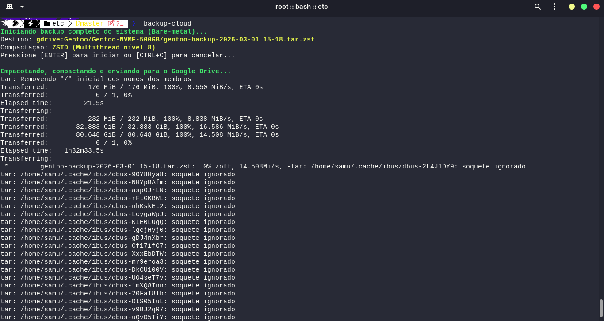
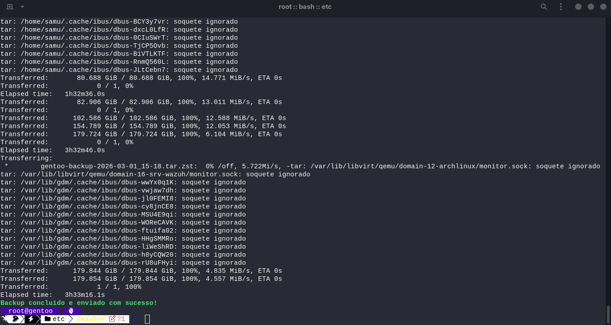
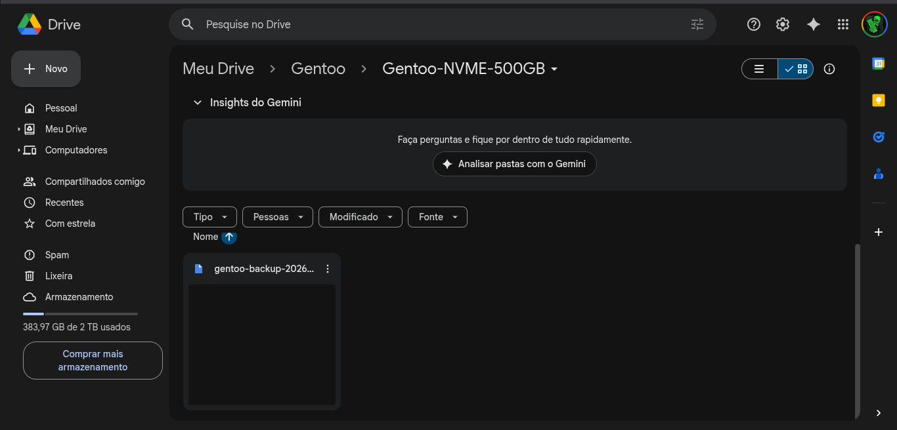

# 🚀 Kernel Gentoo com Hardening, Boot Determinístico e Arquitetura Dual-Build para ThinkPad T490

> > **Arquitetura dual-build determinística · Hardening por arquitetura · Boot determinístico · Recovery e backup bare-metal** 
> Gentoo Linux · ThinkPad T490 · GNOME + OpenRC

---

<div align="center">

[](https://www.gnu.org/software/bash/)
[](https://www.gentoo.org/)
[](https://www.kernel.org/)
[](https://dracut.wiki.kernel.org/)
[](https://www.linux-kvm.org/)
[](https://rclone.org/)
[](LICENSE)

</div>

---

Este repositório documenta a jornada de **engenharia, hardening arquitetural e controle determinístico de build** do kernel Linux
(**Gentoo Sources**) para o **Lenovo ThinkPad T490**.

A trajetória parte de um ponto de entrada real — profile GNOME estável + `genkernel` — e evolui
para um modelo de produção com **arquitetura dual-build determinística e independente** (`safe` e `devops`),
nomeação determinística de todos os artefatos, hardening aplicado diretamente por arquitetura via
`menuconfig` e `./scripts/config`, e automação de backup bare-metal direto na nuvem.

> ❌ Builds não dependem de symlinks como referência lógica &ensp;·&ensp;
> ❌ Sem `make kernelrelease` &ensp;·&ensp;
> ❌ Sem sobrescrever artefatos existentes em `/boot` &ensp;·&ensp;
> ✅ Versões e caminhos explícitos em todos os comandos

---

## 🎯 Objetivos

- **Domínio Técnico:** Aprofundar o conhecimento na arquitetura e nos subsistemas do Kernel Linux
- **Performance:** Reduzir tempo de boot e latência com instruções nativas do hardware Intel
- **Estabilidade:** Garantir compatibilidade total com o T490 — kernel `safe` como fallback imutável
- **Hardening por Arquitetura:** Cada flag de endurecimento habilitada explicitamente, sem herança
  de profile Hardened — controle granular e totalmente auditável
- **Build Dual Determinística:** `devops` e `safe` como diretórios físicos independentes, sem
  dependência de symlinks, sem risco de sobrescrever kernel funcional
- **Virtualização Completa:** KVM/QEMU, Docker, Incus e virt-manager nativos no kernel devops
- **Automação:** Scripts versionados no repositório que eliminam erros manuais e tornam o rollback trivial

---

## 🖥️ Hardware Alvo

| Componente | Detalhes |
| --- | --- |
| CPU | Intel i5-8365U (Whiskey Lake) |
| GPU | Intel UHD Graphics 620 |
| Armazenamento | SSD NVMe Kingston NV3 500GB |
| Rede | Intel I219-LM (Ethernet) + Intel CNVi (Wi-Fi/Bluetooth) |
| Áudio | Intel Cannon Point-LP (SOF / HDA Intel) |
| Segurança | TPM 2.0 · Intel RNG (DRNG/RDRAND) · Secure Boot ready |

---

## 🗺️ Estrutura Real do Sistema

```
/usr/src/
├── linux -> linux-6.12.58-gentoo-devops   ← symlink Gentoo (convenção; builds não dependem dele)
├── linux-6.12.58-gentoo-devops/           ← diretório físico: ambiente de trabalho
├── linux-6.12.58-gentoo-safe/             ← diretório físico: fallback imutável
└── linux-6.18.12-gentoo/                  ← source futuro (ainda não compilado)

/boot/
├── config-6.12.58-gentoo-devops           ← .config de referência do devops
├── config-6.12.58-gentoo-safe             ← .config de referência do safe
├── EFI/
├── grub/
│   └── grub.cfg
├── initramfs/
│   ├── 6.12.58-devops.img
│   ├── 6.12.58-safe.img
│   ├── intel-uc.img                       ← microcódigo Intel
│   └── amd-uc.img                         ← presente, não carregado em hardware Intel
├── kernels/
│   ├── 6.12.58-devops
│   └── 6.12.58-safe
└── System Volume Information/             ← diretório EFI residual (não remover)

/lib/modules/
├── 6.12.58-gentoo-devops/
└── 6.12.58-gentoo-safe/
```

---

## 📁 Estrutura do Repositório

```
gentoo-kernel-t490/
├── scripts/
│   ├── diag-kernel.sh        ← diagnóstico automático da .config
│   └── backup-cloud.sh       ← backup bare-metal → Google Drive
├── docs/
│   ├── assets/
│   │   ├── backup-start.png
│   │   ├── backup-end.png
│   │   └── gdrive.png
│   ├── hardware_t490.txt     ← dump de lspci, lsusb, cpuinfo
│   └── checklist_menuconfig.md
├── .gitignore
├── LICENSE
└── README.md
```

> Os scripts em `scripts/` são a fonte versionada. Cada um documenta onde deve ser instalado
> no sistema (`/usr/local/sbin/`) com as instruções de instalação na seção correspondente.

---

## 🧠 Contexto e Evolução da Estratégia

### Ponto de Partida — Profile GNOME Estável + Genkernel

O sistema foi instalado com o profile padrão estável do Gentoo:

```
default/linux/amd64/23.0/desktop/gnome (stable)
```

Este **não é um profile Hardened** — é o profile GNOME convencional. A compilação inicial do
kernel foi feita com `genkernel` deliberadamente, priorizando compatibilidade máxima de hardware e
um ambiente de boot funcional desde o início.

**Por que `genkernel` como ponto de partida:**

- Garante inicialização estável antes de qualquer customização
- Inclui suporte amplo a drivers e subsistemas — qualquer hardware funciona de saída
- Permite descobrir o que o T490 realmente utiliza em condições reais de uso
- Serve como referência para o `localmodconfig` subsequente

**Limitação conhecida e aceita:** O `genkernel` habilita CPUs AMD, drivers legacy, filesystems
exóticos e subsistemas irrelevantes para o T490 — gerando *bloat* e superfície de ataque
desnecessária. Essa limitação é o ponto de partida justificado para a próxima etapa.

---

### Etapa 2 — Refinamento com `localmodconfig`

> ⚠️ **Antes de executar:** conecte e use ativamente **todos os dispositivos** do hardware —
> fone de ouvido, pen drive, mouse USB, webcam externa. O `localmodconfig` captura apenas os
> módulos **presentes em `lsmod` no momento da execução**. Dispositivos desconectados serão
> silenciosamente removidos da `.config` e não funcionarão no novo kernel.
>
> Para os dispositivos internos do T490, certifique-se de que estejam ativos antes de executar:
> abra uma chamada de vídeo (câmera UVC), conecte um fone (áudio HDA), use o Wi-Fi (CNVi),
> e execute `bluetoothctl show` (Bluetooth Intel). Módulos carregados uma única vez durante a
> sessão — como o driver de impressora ao conectar via USB — também são capturados: vale fazer
> um "tour" completo pelo hardware antes de rodar o comando.

Com o sistema em uso real e todos os dispositivos ativos:

```bash
cd /usr/src/linux-6.12.58-gentoo-safe
make localmodconfig
```

- O sistema em execução é analisado via `lsmod` — apenas módulos ativamente carregados são mantidos
- Drivers AMD, legacy e subsistemas ausentes no T490 são removidos automaticamente
- Dispositivos internos reconhecidos na sessão (áudio, câmera, Wi-Fi, Bluetooth) são preservados
- Resultado: kernel **Intel-only**, progressivamente **monolítico**, com superfície de ataque reduzida

A `.config` resultante, revisada e estabilizada, torna-se a **base do kernel safe**.

---

### Etapa 3 — Build Dual Explícita (Modelo Atual)

A partir da base `safe`, deriva-se o kernel `devops` com extensões para virtualização e containers.
As regras estruturais são absolutas:

| Regra | Detalhe |
| --- | --- |
| Identificação | Por nome + versão explícita em todos os comandos |
| Diretórios de source | Físicos e independentes em `/usr/src/` |
| Kernels em `/boot` | `kernels/6.12.58-devops` e `kernels/6.12.58-safe` |
| Initramfs em `/boot` | `initramfs/6.12.58-devops.img` e `initramfs/6.12.58-safe.img` |
| Config de referência | `/boot/config-6.12.58-gentoo-devops` e `/boot/config-6.12.58-gentoo-safe` |
| Módulos | `/lib/modules/6.12.58-gentoo-devops/` e `/lib/modules/6.12.58-gentoo-safe/` |
| Rollback | Trivial — basta selecionar o kernel `safe` no menu do GRUB |

---

## 🔩 Otimizações do Portage — `make.conf` e Builds Pesados

> ⚠️ **Esta seção não é uma receita a ser seguida cegamente.** As flags abaixo refletem decisões
> tomadas para o hardware específico do T490 (i5-8365U). Adapte os valores de `-j`,
> `--load-average` e `CPU_FLAGS_X86` ao seu hardware antes de aplicar.

### `/etc/portage/make.conf`

```bash
# Flags de compilação — otimização máxima para a CPU local
# -march=native detecta e usa todas as extensões disponíveis; resultado não é portável
COMMON_FLAGS="-march=native -O2 -pipe"
CFLAGS="${COMMON_FLAGS}"
CXXFLAGS="${COMMON_FLAGS}"
FCFLAGS="${COMMON_FLAGS}"
FFLAGS="${COMMON_FLAGS}"

# Paralelismo: -j6 é adequado para i5 quad-core com HT
# Regra geral: número de threads + 2, sem ultrapassar a RAM disponível
MAKEOPTS="-j6"

# --load-average previne travamentos ao usar o PC durante um emerge longo
EMERGE_DEFAULT_OPTS="--jobs=1 --load-average=3.5"

LANG="pt_BR.UTF-8"
L10N="pt-BR en-US"
ACCEPT_LICENSE="*"

# Mirrors brasileiros (UFPR)
GENTOO_MIRRORS="https://gentoo.c3sl.ufpr.br/ rsync://gentoo.c3sl.ufpr.br/gentoo/"

# Extensões de CPU — NÃO copie sem verificar o seu hardware
# Para gerar as flags corretas: emerge app-portage/cpuid2cpuflags && cpuid2cpuflags
# Abaixo as flags do i5-8365U (Whiskey Lake):
CPU_FLAGS_X86="aes avx avx2 bmi bmi2 f16c fma3 mmx mmxext pclmul popcnt rdrand sha sse sse2 sse3 sse4_1 sse4_2 ssse3"

# GPU Intel Iris (UHD 620) — driver Mesa iris (substitui o i965 legado)
VIDEO_CARDS="iris"

# Dispositivos de entrada — libinput para uso geral, synaptics como fallback
INPUT_DEVICES="libinput synaptics"
```

---

### Gerenciando Builds Pesados — Perfis de Ambiente

Alguns pacotes consomem RAM excessiva durante a linkagem e podem causar OOM se compilados com
os `MAKEOPTS` globais. O Portage permite sobrescrever variáveis por pacote.

**`/etc/portage/env/heavy-build.conf`**

```bash
# Reduz paralelismo — -j2 é seguro para sistemas com 8–16 GB em builds pesados
MAKEOPTS="-j2"
EMERGE_DEFAULT_OPTS="--jobs=1"
```

**`/etc/portage/env/no-lto.conf`**

```bash
# Para pacotes que falham com LTO habilitado (Rust, Firefox, SpiderMonkey)
CFLAGS="${CFLAGS} -fno-lto"
CXXFLAGS="${CXXFLAGS} -fno-lto"
```

**`/etc/portage/package.env`**

```
# WebKit — maior vilão em consumo de RAM e tempo de compilação
net-libs/webkit-gtk     heavy-build.conf

# Compiladores e runtimes — linkagem consome RAM em spikes severos
dev-lang/rust           heavy-build.conf
dev-lang/spidermonkey   heavy-build.conf
net-libs/nodejs         heavy-build.conf
sys-devel/llvm          heavy-build.conf
sys-devel/clang         heavy-build.conf

# Evolution — pesado o suficiente para degradar a usabilidade se sem limite
mail-client/evolution   heavy-build.conf
```

---

## 🧩 Fase 1 — Snapshot de Segurança

Antes de qualquer modificação, salve o estado atual do kernel funcional:

```bash
mkdir -p /root/kernel-snapshots/safe

cp /boot/kernels/*       /root/kernel-snapshots/safe/ 2>/dev/null
cp /boot/initramfs/*.img /root/kernel-snapshots/safe/ 2>/dev/null
cp /boot/config-*        /root/kernel-snapshots/safe/ 2>/dev/null
```

---

## 🧬 Fase 2 — Criar Diretórios Físicos dos Kernels

```bash
cd /usr/src

cp -a linux-6.12.58-gentoo linux-6.12.58-gentoo-safe
cp -a linux-6.12.58-gentoo linux-6.12.58-gentoo-devops
```

> Os diretórios são cópias físicas completas e independentes. O symlink `/usr/src/linux`
> existe por convenção do Gentoo e aponta para o `devops`, mas nenhum comando de build o utiliza.

---

## 🛡️ Fase 3 — Build do Kernel SAFE (Fallback Imutável)

O kernel `safe` é construído a partir de uma `.config` estável e auditada. Após compilado
e validado, **não é modificado** — serve exclusivamente como fallback garantido. A configuração
base (golden config) é versionada neste próprio repositório para garantir reprodutibilidade (IaC).

```bash
# 1. Entra estritamente no diretório físico do kernel safe
cd /usr/src/linux-6.12.58-gentoo-safe

# 2. Recupera a configuração estável diretamente do repositório versionado
cp ~/linux-6.12.58-gentoo/configs/config-6.12.58-safe .config

# 3. Resolve novas opções do Kconfig com os defaults seguros
make olddefconfig

# 4. Compila usando todos os núcleos físicos/lógicos disponíveis
make -j$(nproc)

# 5. Instala os módulos no sistema (/lib/modules/6.12.58-gentoo-safe/)
make modules_install

# 6. Copia o kernel para a estrutura isolada de boot
cp arch/x86/boot/bzImage /boot/kernels/6.12.58-safe

# 7. Salva a .config de referência na raiz de /boot para auditoria rápida
cp .config /boot/config-6.12.58-gentoo-safe

# 8. Gera o initramfs com kver hardcoded, vinculado exclusivamente a esta arquitetura
dracut --force \
  /boot/initramfs/6.12.58-safe.img \
  6.12.58-gentoo-safe
```

---

## ⚙️ Fase 4 — Build do Kernel DEVOPS

O kernel `devops` deriva da base `safe` e recebe extensões para virtualização, containers
e o ecossistema completo de ferramentas de trabalho.

### 4.1 — Preparação

```bash
cd /usr/src/linux-6.12.58-gentoo-devops

# Parte da base estável e validada do safe
cp /usr/src/linux-6.12.58-gentoo-safe/.config .config
```

---

### 4.2 — Aplicando Configurações com `./scripts/config`

> ⚠️ **Importante:** O bloco abaixo serve para **agilizar** a aplicação das flags. Algumas
> opções podem não ser aplicadas corretamente por dependências ou conflitos de Kconfig.
> **Após executar, sempre valide com `make menuconfig`** antes de compilar.

```bash
# ─────────────────────────────────────────────────────────────
# STORAGE, FILESYSTEM E BOOT ESSENCIAL
# ─────────────────────────────────────────────────────────────
./scripts/config --enable  NVME_CORE
./scripts/config --enable  BLK_DEV_NVME
./scripts/config --enable  EXT4_FS
./scripts/config --enable  VFAT_FS
./scripts/config --enable  DEVTMPFS
./scripts/config --enable  DEVTMPFS_MOUNT
./scripts/config --enable  INITRAMFS_COMPRESSION_GZIP
./scripts/config --enable  BLK_DEV_LOOP
./scripts/config --enable  CRYPTO_SHA256
./scripts/config --enable  BLK_DEV_DM
./scripts/config --disable DEVMEM

# ─────────────────────────────────────────────────────────────
# SATA / AHCI (SSD/HDD secundário)
# ─────────────────────────────────────────────────────────────
./scripts/config --enable ATA
./scripts/config --enable AHCI

# ─────────────────────────────────────────────────────────────
# GPU / EFI / CPU / MICROCÓDIGO
# ─────────────────────────────────────────────────────────────
./scripts/config --enable EFI_STUB
./scripts/config --enable MICROCODE
./scripts/config --enable MICROCODE_INTEL
./scripts/config --module DRM_I915

# ─────────────────────────────────────────────────────────────
# VIRTUALIZAÇÃO — KVM, QEMU, virt-manager, Incus, Docker
# ─────────────────────────────────────────────────────────────
./scripts/config --enable KVM
./scripts/config --enable KVM_INTEL
./scripts/config --enable VIRTUALIZATION
./scripts/config --enable VHOST_NET
./scripts/config --enable VHOST_VSOCK
./scripts/config --enable VIRTIO_PCI
./scripts/config --enable VIRTIO_NET
./scripts/config --enable VIRTIO_BLK
./scripts/config --enable VIRTIO_CONSOLE
./scripts/config --enable VIRTIO_BALLOON
./scripts/config --enable VIRTIO_INPUT
./scripts/config --enable VIRTIO_FS
./scripts/config --enable IO_URING
./scripts/config --enable VHOST_CROSS_ENDIAN_LEGACY

# ─────────────────────────────────────────────────────────────
# CONTAINERS — Docker, Incus, LXC, Podman
# ─────────────────────────────────────────────────────────────
./scripts/config --enable NAMESPACES
./scripts/config --enable UTS_NS
./scripts/config --enable IPC_NS
./scripts/config --enable USER_NS
./scripts/config --enable PID_NS
./scripts/config --enable NET_NS
./scripts/config --enable CGROUPS
./scripts/config --enable CGROUP_CPUACCT
./scripts/config --enable CGROUP_DEVICE
./scripts/config --enable CGROUP_FREEZER
./scripts/config --enable CGROUP_SCHED
./scripts/config --enable CGROUP_PIDS
./scripts/config --enable MEMCG
./scripts/config --enable BLK_CGROUP
./scripts/config --enable OVERLAY_FS

# ─────────────────────────────────────────────────────────────
# REDE — Wi-Fi Intel, Bridge, TUN, VLAN, VXLAN, Netfilter
# ─────────────────────────────────────────────────────────────
./scripts/config --module IWLWIFI
./scripts/config --module IWLMVM
./scripts/config --enable E1000E
./scripts/config --enable BRIDGE
./scripts/config --enable BRIDGE_NETFILTER
./scripts/config --enable TUN
./scripts/config --enable VLAN_8021Q
./scripts/config --enable VXLAN
./scripts/config --enable NETFILTER
./scripts/config --enable NETFILTER_ADVANCED
./scripts/config --enable IP_NF_IPTABLES
./scripts/config --enable IP_NF_NAT
./scripts/config --enable NF_NAT
./scripts/config --enable NF_TABLES

# Remove vendedores de rede não-Intel
./scripts/config --disable NET_VENDOR_AMD
./scripts/config --disable NET_VENDOR_BROADCOM
./scripts/config --disable NET_VENDOR_REALTEK
./scripts/config --disable NET_VENDOR_VIA

# ─────────────────────────────────────────────────────────────
# ÁUDIO E CÂMERA (ThinkPad T490)
# ─────────────────────────────────────────────────────────────
./scripts/config --module SND_HDA_INTEL
./scripts/config --module USB_VIDEO_CLASS
./scripts/config --module VIDEO_UVC

# ─────────────────────────────────────────────────────────────
# THINKPAD T490 / ACPI / ENERGY
# ─────────────────────────────────────────────────────────────
./scripts/config --module THINKPAD_ACPI
./scripts/config --enable X86_INTEL_LPSS
./scripts/config --enable INTEL_PSTATE

# Remove drivers de vídeo AMD/Nvidia
./scripts/config --disable DRM_RADEON
./scripts/config --disable DRM_AMDGPU
./scripts/config --disable DRM_NOUVEAU

# ─────────────────────────────────────────────────────────────
# PASSTHROUGH — VFIO / IOMMU (KVM GPU passthrough)
# ─────────────────────────────────────────────────────────────
./scripts/config --enable IOMMU_SUPPORT
./scripts/config --enable INTEL_IOMMU
./scripts/config --enable VFIO
./scripts/config --enable VFIO_PCI
./scripts/config --enable VFIO_VIRQFD
./scripts/config --enable VFIO_MDEV
./scripts/config --enable VFIO_IOMMU_TYPE1

# ─────────────────────────────────────────────────────────────
# USB — XHCI, Serial (ESP32/hardware hacking)
# ─────────────────────────────────────────────────────────────
./scripts/config --enable USB_XHCI_HCD
./scripts/config --enable USB_SERIAL_CP210X

# ─────────────────────────────────────────────────────────────
# SPICE / DISPLAY VIRTUAL (virt-manager / QEMU)
# ─────────────────────────────────────────────────────────────
./scripts/config --enable DRM_VIRTIO_GPU
./scripts/config --enable DRM_VIRTIO_GPU_KMS
./scripts/config --enable HID
./scripts/config --enable USB_HID
./scripts/config --enable INPUT_TABLET
./scripts/config --enable HID_MULTITOUCH

# ─────────────────────────────────────────────────────────────
# BLUETOOTH INTEL
# ─────────────────────────────────────────────────────────────
./scripts/config --module BT_HCIBTUSB
./scripts/config --module BT_INTEL

# ─────────────────────────────────────────────────────────────
# FIRMWARE LOADER
# ─────────────────────────────────────────────────────────────
./scripts/config --enable FW_LOADER

# ─────────────────────────────────────────────────────────────
# POWER MANAGEMENT / SUSPENSÃO
# ─────────────────────────────────────────────────────────────
./scripts/config --enable PM
./scripts/config --enable PM_SLEEP
./scripts/config --enable PM_RUNTIME

# ─────────────────────────────────────────────────────────────
# FINGERPRINT (ThinkPad T490)
# ─────────────────────────────────────────────────────────────
./scripts/config --enable UHID
./scripts/config --module FINGERPRINT_SENSOR

# ─────────────────────────────────────────────────────────────
# DISPOSITIVOS ANDROID / SERIAL / USB
# ─────────────────────────────────────────────────────────────
./scripts/config --enable USB_ACM
./scripts/config --enable USB_WDM
./scripts/config --enable USB_NET_RNDIS_WLAN
./scripts/config --enable USB_SERIAL_OPTION

# ─────────────────────────────────────────────────────────────
# IMPRESSÃO E SCANNER (HPLIP / DeskJet F2025)
# ─────────────────────────────────────────────────────────────
./scripts/config --enable USB_PRINTER
./scripts/config --enable FUSE_FS
./scripts/config --enable PARPORT
./scripts/config --module PPDEV
./scripts/config --enable LP_CONSOLE

# ─────────────────────────────────────────────────────────────
# SEGURANÇA — Hardening por arquitetura (sem profile Hardened)
# ─────────────────────────────────────────────────────────────
./scripts/config --enable  STACKPROTECTOR_STRONG
./scripts/config --enable  SLAB_FREELIST_HARDENED
./scripts/config --enable  FORTIFY_SOURCE
./scripts/config --enable  STRICT_KERNEL_RWX
./scripts/config --enable  STRICT_MODULE_RWX
./scripts/config --disable LEGACY_VSYSCALL_EMULATE
```

---

### 4.3 — Auditando o "Peso Morto" Ativo

Verifique o que ainda está habilitado (=y ou =m) relacionado a AMD, Apple, Radeon ou Nouveau:

```bash
grep -E -i "amd|radeon|nouveau|apple|mac" .config | grep -v "^#"
```

Para desativar automaticamente todos os encontrados:

```bash
for opt in $(grep -E "AMD|APPLE|NOUVEAU|RADEON|BRCM" .config | cut -d= -f1); do
    ./scripts/config --disable "${opt}"
done
```

> ⚠️ Após este loop, confirme no `make menuconfig` que nada essencial foi removido por engano.

---

### 4.4 — Verificação Pré-Compilação

**Verificação completa em linha única:**

```bash
grep -E "CONFIG_BLK_DEV_NVME|CONFIG_INITRAMFS_COMPRESSION_GZIP|\
CONFIG_ATA|CONFIG_AHCI|CONFIG_EFI_STUB|CONFIG_MICROCODE|CONFIG_MICROCODE_INTEL|\
CONFIG_DRM_I915|CONFIG_KVM|CONFIG_KVM_INTEL|CONFIG_VIRTUALIZATION|\
CONFIG_VIRTIO_|CONFIG_VHOST_|CONFIG_NAMESPACES|CONFIG_CGROUPS|CONFIG_OVERLAY_FS|\
CONFIG_IWLWIFI|CONFIG_IWLMVM|CONFIG_E1000E|CONFIG_BRIDGE|CONFIG_TUN|\
CONFIG_VLAN_8021Q|CONFIG_VXLAN|CONFIG_NETFILTER|CONFIG_SND_HDA_INTEL|\
CONFIG_USB_VIDEO_CLASS|CONFIG_VIDEO_UVC|CONFIG_THINKPAD_ACPI|\
CONFIG_X86_INTEL_LPSS|CONFIG_INTEL_PSTATE|CONFIG_IOMMU_SUPPORT|\
CONFIG_INTEL_IOMMU|CONFIG_VFIO|CONFIG_USB_XHCI_HCD|CONFIG_USB_SERIAL_CP210X|\
CONFIG_USB_HID|CONFIG_INPUT_TABLET|CONFIG_HID_MULTITOUCH|\
CONFIG_BT_HCIBTUSB|CONFIG_BT_INTEL|CONFIG_PM|CONFIG_PM_SLEEP|CONFIG_PM_RUNTIME|\
CONFIG_UHID|CONFIG_FINGERPRINT_SENSOR|CONFIG_USB_ACM|CONFIG_USB_WDM|\
CONFIG_USB_NET_RNDIS_WLAN|CONFIG_USB_SERIAL_OPTION|CONFIG_USB_PRINTER|\
CONFIG_FUSE_FS|CONFIG_PARPORT|CONFIG_PPDEV|CONFIG_LP_CONSOLE|\
CONFIG_STACKPROTECTOR_STRONG|CONFIG_SLAB_FREELIST_HARDENED|\
CONFIG_FORTIFY_SOURCE|CONFIG_STRICT_KERNEL_RWX|CONFIG_STRICT_MODULE_RWX|\
CONFIG_LEGACY_VSYSCALL_EMULATE" .config
```

**Diagnóstico agrupado por subsistema — execute `scripts/diag-kernel.sh`:**

```bash
# Execute dentro do diretório de source do kernel que deseja auditar
cd /usr/src/linux-6.12.58-gentoo-devops
bash /path/to/repo/scripts/diag-kernel.sh
```

Ver: [`scripts/diag-kernel.sh`](scripts/diag-kernel.sh)

---

### 4.5 — Validação Final no `menuconfig`

Após o script de configuração, sempre revise no `menuconfig`. Algumas opções exigem dependências
que o `./scripts/config` não resolve automaticamente:

```bash
make menuconfig
```

---

### 4.6 — Compilação e Instalação do Kernel DEVOPS

> ⚠️ Execute os comandos abaixo **dentro do diretório físico correto**, com paths explícitos.

```bash
cd /usr/src/linux-6.12.58-gentoo-devops

# Compila usando todos os núcleos
make -j$(nproc)

# Instala os módulos em /lib/modules/6.12.58-gentoo-devops/
make modules_install INSTALL_MOD_PATH=/

# Copia o kernel para a estrutura de /boot
cp arch/x86/boot/bzImage /boot/kernels/6.12.58-devops

# Salva a .config de referência
cp .config /boot/config-6.12.58-gentoo-devops

# Gera o initramfs com kver hardcoded
dracut --force \
  /boot/initramfs/6.12.58-devops.img \
  6.12.58-gentoo-devops
```

---

## 🧭 Fase 5 — GRUB (Grand Finale)

Como a estrutura de `/boot` usa subdiretórios (`kernels/` e `initramfs/`) fora do padrão esperado pelo `grub-mkconfig`, a detecção automática deve ser desativada para dar lugar a entradas explícitas e hardcoded.

> ⚠️ **ATENÇÃO 1: UUIDs Únicos de Hardware**
> Os valores de UUID no script abaixo (`EED9-6AFE` para a partição EFI e `48d42ece-...` para a partição raiz) pertencem **exclusivamente** ao SSD NVMe Kingston desta máquina. 
> Se for reproduzir este setup em outro hardware, **você deve obrigatoriamente substituir esses valores**. 
> Para descobrir os UUIDs corretos do seu disco, execute `blkid` e identifique:
> 1. A partição EFI (geralmente formatada como `TYPE="vfat"`)
> 2. A partição Raiz `/` do Linux (geralmente formatada como `TYPE="ext4"`, `xfs` ou `btrfs`)
> 
> ```bash
> blkid
> ```

> ⚠️ **ATENÇÃO 2: Manutenção de Versões (Hardcoded)**
> O princípio do boot determinístico exige que o bootloader saiba exatamente o que carregar. As versões do kernel (ex: `6.12.58-devops`) estão "chumbadas" no script abaixo. **Em atualizações futuras (ex: migração para o source `linux-6.18.12-gentoo`), você deverá editar este arquivo `40_custom` e alterar os números de versão** antes de regerar o GRUB. (Nota: A nossa automação `deploy-kernel` audita essa consistência e emitirá um alerta caso você esqueça).

Desative a varredura genérica e crie o seu script de boot personalizado, garantindo um boot determinístico:

```bash
chmod -x /etc/grub.d/10_linux
vim /etc/grub.d/40_custom
```

```sh
#!/bin/sh

# ── Kernel DevOps (Principal) ────────────────────────────────
if [ -f /boot/kernels/6.12.58-devops ] && \
   [ -f /boot/initramfs/6.12.58-devops.img ]; then
    echo "Encontrado: /boot/kernels/6.12.58-devops" >&2
    cat << 'EOF'
menuentry "Gentoo DevOps 6.12.58 (Principal)" {
    load_video
    insmod gzio
    insmod part_gpt
    insmod fat
    insmod ext2
    search --no-floppy --fs-uuid --set=root EED9-6AFE

    echo 'Carregando o Linux DevOps...'
    linux /kernels/6.12.58-devops root=UUID=48d42ece-9c38-4ea1-a964-22f00dcfc697 rw

    echo 'Carregando o ramdisk inicial...'
    initrd /initramfs/intel-uc.img /initramfs/6.12.58-devops.img
}
EOF
else
    echo "AVISO CRÍTICO: Kernel DevOps ou Initramfs ausente!" >&2
fi

# ── Kernel Safe (Fallback) ───────────────────────────────────
if [ -f /boot/kernels/6.12.58-safe ] && \
   [ -f /boot/initramfs/6.12.58-safe.img ]; then
    echo "Encontrado: /boot/kernels/6.12.58-safe" >&2
    cat << 'EOF'
menuentry "Gentoo SAFE 6.12.58 (Fallback)" {
    load_video
    insmod gzio
    insmod part_gpt
    insmod fat
    insmod ext2
    search --no-floppy --fs-uuid --set=root EED9-6AFE

    echo 'Carregando o Linux SAFE...'
    linux /kernels/6.12.58-safe root=UUID=48d42ece-9c38-4ea1-a964-22f00dcfc697 ro single

    echo 'Carregando o ramdisk inicial...'
    initrd /initramfs/intel-uc.img /initramfs/6.12.58-safe.img
}
EOF
else
    echo "AVISO CRÍTICO: Kernel SAFE ou Initramfs ausente!" >&2
fi
```

```bash
grub-mkconfig -o /boot/grub/grub.cfg
```

### Commitando no `/etc` com etckeeper

```bash
cd /etc
git add grub.d/10_linux grub.d/40_custom
git commit -m "boot: estrutura customizada kernels/ e initramfs/, desabilita 10_linux"
```

---

## 🐳 Virtualização e Containers — Ecossistema Completo

O kernel `devops` suporta o ecossistema completo de virtualização e containers.

### Docker

```bash
emerge -av app-containers/docker app-containers/docker-cli

rc-update add docker default
rc-service docker start

# Valida compatibilidade do kernel
docker info 2>&1 | grep -i "WARNING\|ERROR" || echo "✔ Kernel compatível com Docker"
```

**Flags necessárias** (já aplicadas): `NAMESPACES`, `NET_NS`, `USER_NS`, `CGROUPS`, `MEMCG`,
`OVERLAY_FS`, `BRIDGE`, `NF_NAT`, `NF_TABLES`.

---

### Incus (successor do LXD)

```bash
emerge -av app-containers/incus

rc-update add incus default
rc-update add incus-startup boot
incus admin init

incus version
incus launch images:ubuntu/22.04 test-container
incus list
```

**Flags necessárias:** `NAMESPACES`, `USER_NS`, `PID_NS`, `UTS_NS`, `NET_NS`, `CGROUPS`,
`CGROUP_DEVICE`, `MEMCG`, `OVERLAY_FS`, `BRIDGE`, `VXLAN`.

---

### QEMU / KVM

```bash
emerge -av app-emulation/qemu

ls /dev/kvm && echo "✔ KVM disponível"
grep -E "vmx|svm" /proc/cpuinfo | head -1
gpasswd -a $USER kvm
```

**Flags necessárias:** `KVM`, `KVM_INTEL`, `IOMMU_SUPPORT`, `INTEL_IOMMU`, `VFIO`, `VFIO_PCI`,
`VIRTIO_*`, `VHOST_NET`.

**Exemplo de VM básica com virtio:**

```bash
qemu-system-x86_64 \
  -enable-kvm -m 4G -cpu host -smp 4 \
  -drive file=disk.qcow2,format=qcow2 \
  -device virtio-net-pci -net user
```

---

### virt-manager (Interface Gráfica para KVM/QEMU)

```bash
emerge -av app-emulation/virt-manager

rc-update add libvirtd default
rc-service libvirtd start
gpasswd -a $USER libvirt

virsh net-start default
virsh net-autostart default
virt-manager
```

**Flags adicionais necessárias:** `VHOST_VSOCK`, `DRM_VIRTIO_GPU`, `USB_HID`, `INPUT_TABLET`,
`HID_MULTITOUCH` — necessários para console SPICE funcional.

---

### Tabela de Compatibilidade de Kernel por Ferramenta

| Ferramenta | KVM | Namespaces | cgroups | OverlayFS | VFIO | Virtio |
| --- | :---: | :---: | :---: | :---: | :---: | :---: |
| Docker | ❌ | ✅ | ✅ | ✅ | ❌ | ❌ |
| Incus | ❌ | ✅ | ✅ | ✅ | ❌ | ❌ |
| QEMU/KVM | ✅ | ❌ | ❌ | ❌ | Opcional | ✅ |
| virt-manager | ✅ | ❌ | ❌ | ❌ | Opcional | ✅ |
| GPU Passthrough | ✅ | ❌ | ❌ | ❌ | ✅ | ❌ |

---

## ☁️ Backup Bare-Metal para Google Drive

O script `scripts/backup-cloud.sh` realiza um backup completo do sistema, compactando com ZSTD
multithread e enviando em pipeline direto ao Google Drive via `rclone` — sem consumir espaço
extra no SSD local.

**Instalação no sistema:**

```bash
cp scripts/backup-cloud.sh /usr/local/sbin/backup-cloud
chmod +x /usr/local/sbin/backup-cloud
```

Ver: [`scripts/backup-cloud.sh`](scripts/backup-cloud.sh)

---

### Lista de Exclusão

```bash
vim /etc/backup-exclude.list
```

```
/dev/*
/proc/*
/sys/*
/run/*
/tmp/*
/var/tmp/*
/var/cache/distfiles/*
/var/cache/binpkgs/*
/mnt/*
/media/*
lost+found
```

**Uso:**

```bash
backup-cloud
```

> Os avisos `soquete ignorado` do `tar` são **esperados e inofensivos** — referem-se a Unix
> sockets do IBus, libvirt e GDM. O sucesso é verificado exclusivamente pelo `PIPESTATUS[2]`
> do `rclone`.

### Execução Real — 179 GiB em ~3h33m

**Início do backup — pipeline TAR → ZSTD → rclone em execução:**



**Finalização — 179.854 GiB transferidos com sucesso:**



**Google Drive — arquivo `gentoo-backup-2026-03-01_15-18.tar.zst` gravado em `Gentoo/Gentoo-NVME-500GB/`:**



> **Resultado:** `179.854 GiB` · ~14 MiB/s · `3h33m16s` · ZSTD multithread nível 8  
> Sem uso de espaço adicional no SSD local durante a transferência.

---

## 📘 Referências Técnicas

| Recurso | Link |
| --- | --- |
| Gentoo Handbook — AMD64 | [wiki.gentoo.org](https://wiki.gentoo.org/wiki/Handbook:AMD64) |
| Gentoo Kernel Configuration | [wiki.gentoo.org/Kernel/Configuration](https://wiki.gentoo.org/wiki/Kernel/Configuration) |
| Gentoo Security Hardening | [wiki.gentoo.org/wiki/Hardened_Gentoo](https://wiki.gentoo.org/wiki/Hardened_Gentoo) |
| ThinkPad T490 — ArchWiki | [wiki.archlinux.org](https://wiki.archlinux.org/title/Lenovo_ThinkPad_T490) |
| Dracut — initramfs generator | [dracut.wiki.kernel.org](https://dracut.wiki.kernel.org/) |
| QEMU / KVM — Gentoo | [wiki.gentoo.org/wiki/QEMU](https://wiki.gentoo.org/wiki/QEMU) |
| Incus (LXD successor) | [linuxcontainers.org/incus](https://linuxcontainers.org/incus/) |
| Docker — Gentoo | [wiki.gentoo.org/wiki/Docker](https://wiki.gentoo.org/wiki/Docker) |
| virt-manager | [virt-manager.org](https://virt-manager.org/) |
| GRUB Manual | [gnu.org/software/grub](https://www.gnu.org/software/grub/manual/grub/) |
| rclone Documentation | [rclone.org/docs](https://rclone.org/docs/) |
| Bash Reference Manual | [gnu.org/software/bash](https://www.gnu.org/software/bash/manual/) |
| ShellCheck — linter Bash | [shellcheck.net](https://www.shellcheck.net/) |
| Linux Kernel Documentation | [kernel.org/doc](https://www.kernel.org/doc/html/latest/) |

---

## 📜 Licença

MIT License

---

<div align="center">

⚠️ **Aviso:** Configurações altamente específicas para o **Lenovo ThinkPad T490**  
com profile `default/linux/amd64/23.0/desktop/gnome` (stable).  
Não recomendado para uso genérico sem revisão criteriosa das UUIDs, paths e flags de hardware.

</div>
